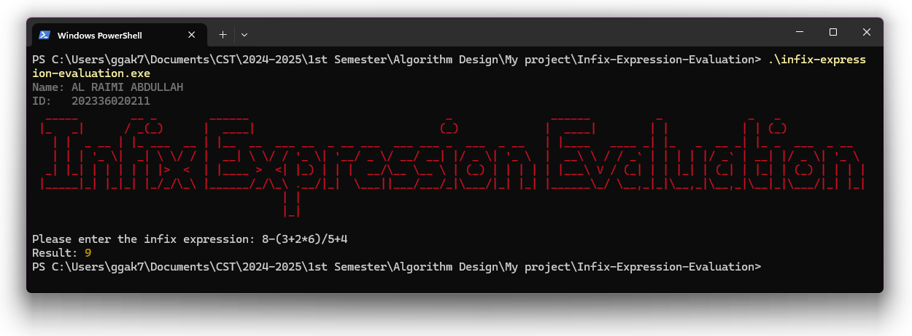

  

  
  
  

# Infix Expression Evaluation

This project evaluates arithmetic expressions written in infix notation using a stack-based approach. The goal is to convert the infix expression to postfix form and evaluate it efficiently by considering operator precedence and parentheses. The program can handle addition, subtraction, multiplication, and division.

### Algorithm Specification

#### Key Concepts
- **Infix Notation**: Arithmetic expressions in which operators are placed between operands (e.g., `8-(3+2*6)/5+4`).
- **Operator Precedence**: Different operators have different priorities. Multiplication and division are evaluated before addition and subtraction unless parentheses override the precedence.
- **Stack-Based Evaluation**: Stacks are used to hold operands and operators during the evaluation process.

#### Explanation of Code

The program is implemented in C++ and uses two stacks:
- `OPND`: A stack that stores operands (numbers).
- `OPTR`: A stack that stores operators (+, -, *, /, etc.).

##### Functions Used
1. **`precede`**: Compares the precedence of two operators. It returns:
   - `1` if the first operator has higher precedence,
   - `0` if both have the same precedence,
   - `-1` if the first operator has lower precedence.

2. **`operate`**: Takes two operands and an operator, performs the operation, and returns the result. It handles the four basic operations: addition, subtraction, multiplication, and division.

3. **`calculate`**: The core function that processes the infix expression. It:
   - Scans the input expression,
   - Pushes numbers (operands) onto the operand stack (`OPND`),
   - Pushes operators onto the operator stack (`OPTR`) while considering their precedence,
   - When an operator with lower precedence is encountered, the program pops operators from the `OPTR` stack, performs the corresponding operations, and pushes the results onto the `OPND` stack.
   - At the end, the operand stack contains the final result.

4. **`displaySignature`**: Displays a special title and signature in the terminal, including your name, ID, and a stylized signature.

##### Sample Input and Output
- **Input**: `8-(3+2*6)/5+4`
- **Output**: `9`

##### Code Walkthrough
- The program begins by prompting the user to enter an infix expression.
- It processes each character of the input:
  - If it’s a number, the number is pushed onto the operand stack (`OPND`).
  - If it’s an operator, the program uses the `precede` function to compare its precedence with the operator at the top of the operator stack (`OPTR`).
  - Depending on the comparison, the program either pushes the operator onto the stack or performs the corresponding operations.
- The process continues until the input expression is fully parsed and evaluated.
- The result of the expression is printed in yellow to highlight the output.

##### Example Execution
Here’s an example of what the output would look like:

