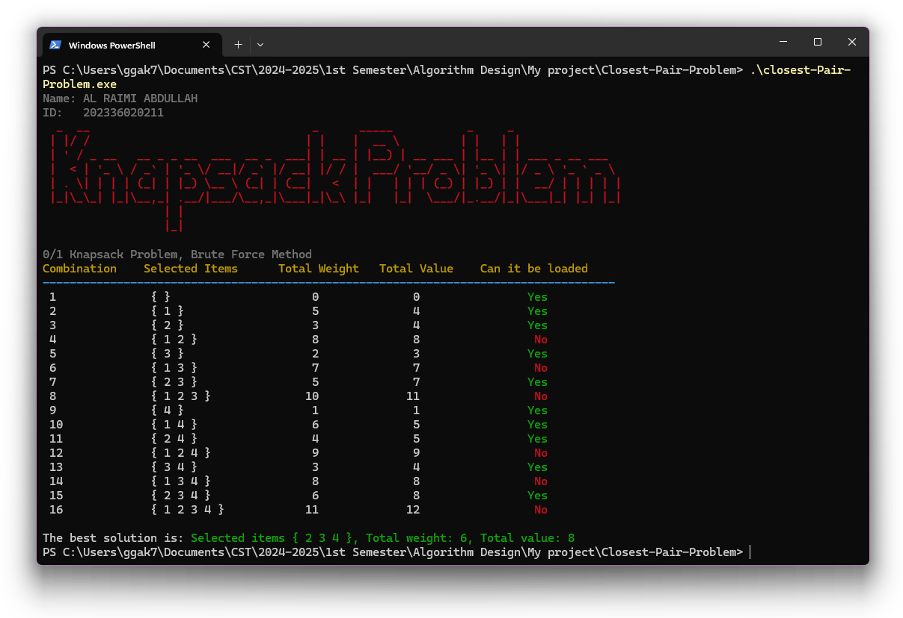

<p align="center">
  <a href="https://syalux.com" target="_blank">
    
  </a>
</p>

<p align="center">
  <a href="https://github.com/Al-rimi/Algorithm-design/releases">
    
  </a>
  <a href="https://github.com/Al-rimi/Algorithm-design/issues">
    
  </a>
  <a href="https://opensource.org/licenses/MIT">
    
  </a>
</p>

# 0/1 Knapsack Problem - Brute Force Method

This project is a C++ implementation of the **0/1 Knapsack Problem** using the brute-force method. The objective is to explore all possible combinations of items and determine the optimal subset that fits within the knapsack's weight capacity while maximizing the total value.

## Algorithm Specification

### Problem Definition

The **0/1 Knapsack Problem** can be described as follows:
- You are given `n` items, each having:
  - **Weight**: `w[i]`
  - **Value**: `v[i]`
- You are also given a knapsack that has a weight capacity `W`.

The task is to select a subset of the items such that:
- The total weight of the selected items does not exceed `W`.
- The total value of the selected items is maximized.

Each item can either be included (1) or excluded (0) from the knapsack, which is why this is called the **0/1 Knapsack Problem**.

### Brute Force Approach

The brute-force approach works by:
1. **Generating all possible subsets** of the items. Since there are `n` items, there are `2^n` possible subsets.
2. **Calculating the total weight and total value** for each subset.
3. If the total weight is less than or equal to the knapsack capacity `W`, the algorithm checks if the current subset has the highest value so far.
4. The subset with the highest total value is recorded as the optimal solution.

#### Step-by-Step Example

Given the following items:

| Item | Weight | Value |
|------|--------|-------|
|  1   |   5    |   4   |
|  2   |   3    |   4   |
|  3   |   2    |   3   |
|  4   |   1    |   1   |

- **Knapsack Capacity (W):** 6  
- The brute-force algorithm will evaluate all subsets and determine which combination yields the maximum value without exceeding the knapsack's weight capacity.

### Time Complexity
The brute-force method has a time complexity of **O(2^n)**, where `n` is the number of items. This is because for each item, there are two choices: either include the item or exclude it, resulting in `2^n` possible combinations to evaluate.

## Key Features

- **Exhaustive Search**: This implementation evaluates every possible combination of items.
- **Detailed Output**: Each combination is displayed with its selected items, total weight, total value, and whether the knapsack can carry it.
- **Colored Terminal Output**: Using ANSI color codes, valid solutions (within the weight limit) are shown in green, while invalid ones are marked in red.
- **Visual Table**: The program displays the results in a neat, aligned table format.
- **Author Signature**: Includes a custom signature output with author's details.

## Example Output

Here is an example of how the program's output looks in the terminal:

```shell
 Combination    Selected Items    Total Weight    Total Value    Can it be loaded
 ---------------------------------------------------------------------------------
 1              { 1 }             5              4              Yes
 2              { 2 }             3              4              Yes
 3              { 3 4 }           3              4              Yes
 4              { 1 3 }           7              7              No
 ...
The best solution is: Selected items { 2 3 }, Total weight: 5, Total value: 7
```

## Algorithm Breakdown

### Combination Generation:
- The program uses **bitwise operations** to represent subsets of items.
- If the `i-th` bit in a binary representation of a number is set, that item is included in the subset.

### Weight and Value Calculation:
- For each subset, it computes the **total weight** by summing the weights of included items.
- Similarly, it computes the **total value** by summing the values of included items.

### Feasibility Check:
- If the **total weight** of a subset is less than or equal to the knapsack's capacity, it is considered a **feasible solution**.

### Optimal Solution:
- Among all feasible solutions, the program keeps track of the one with the **highest total value**.

##### Example Execution
Here’s an example of what the output would look like:




## Learning Resources

Here are some helpful resources for understanding and implementing the 0/1 Knapsack problem:

- [**Knapsack Problem - GeeksforGeeks**](https://www.geeksforgeeks.org/0-1-knapsack-problem-dp-10/)  
  A comprehensive tutorial on the 0/1 Knapsack Problem, including both brute-force and dynamic programming solutions.

- [**Brute Force Algorithms - Wikipedia**](https://en.wikipedia.org/wiki/Brute-force_search)  
  An overview of brute-force search algorithms and their applications in combinatorial optimization.

- [**Bit Manipulation in C++ - Programiz**](https://www.programiz.com/cpp-programming/bitwise-operators)  
  Learn how bit manipulation is used to generate combinations efficiently in the knapsack problem.

- [**ANSI Color Codes in C++**](https://tldp.org/HOWTO/Bash-Prompt-HOWTO/x329.html)  
  This guide explains how to use ANSI escape codes to color terminal output, as done in this project.

- [**Algorithm Complexity - Khan Academy**](https://www.khanacademy.org/computing/computer-science/algorithms/algorithmic-efficiency/a/big-o-notation)  
  A great resource to understand the time complexity of algorithms, including brute-force methods.

## Security Vulnerabilities

If you discover a security vulnerability in the project, please email Abdullah Al Raimi at [abdullah@syalux.com](mailto:abdullah@syalux.com). All security vulnerabilities will be promptly addressed.

## License

This project is licensed under the [MIT license](../LICENSE).
