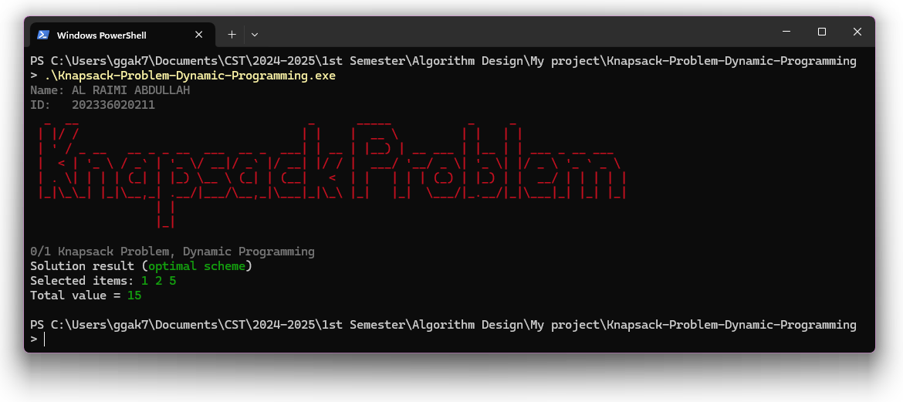

  

  
  
  

# 0/1 Knapsack Problem, Dynamic Programming

The **0/1 Knapsack Problem** is a fundamental problem in combinatorial optimization. The task is to determine the most valuable subset of items to pack into a knapsack of limited capacity, ensuring that the total weight does not exceed the limit. The "0/1" aspect means that each item can either be included or excluded, but not partially.

## Key Features

- **Dynamic Programming Approach**: Efficiently calculates the optimal solution for the knapsack problem.
- **Traceback Mechanism**: Displays which items are selected for the best solution.
- **ANSI Terminal Colors**: Adds colored output to improve readability in the terminal.
- **Signature Graphic**: A fun, personalized signature graphic is displayed at the end of the program output.

## Problem Explanation

- You are given a set of `n` items, each with a **weight** and a **value**.
- You also have a **knapsack** with a limited capacity `W` (i.e., the total weight it can carry).
- The objective is to maximize the total value of the items in the knapsack without exceeding the capacity.

### Inputs:
- `n`: Number of items.
- `W`: Maximum capacity of the knapsack.
- `w[]`: Array of weights for the items.
- `v[]`: Array of values for the items.

### Outputs:
- The **optimal value** that can be carried in the knapsack.
- The **list of selected items** that provide the optimal value.

## Dynamic Programming Approach

Dynamic Programming (DP) provides an efficient solution to the 0/1 Knapsack Problem by building up a solution incrementally. We solve the problem by breaking it down into smaller sub-problems and storing the results to avoid recalculating them.

### Algorithm Specifications:

1. **DP Table Creation:**
   - Create a 2D DP table `dp[n + 1][W + 1]` where each entry `dp[i][j]` represents the maximum value that can be obtained using the first `i` items and a knapsack capacity of `j`.

2. **Filling the DP Table:**
   - For each item `i` (from 1 to `n`), and for each capacity `j` (from 0 to `W`):
     - If the current item's weight `w[i - 1]` is less than or equal to the current capacity `j`, you have two choices:
       1. **Exclude the item**: The value remains the same as the previous row, `dp[i-1][j]`.
       2. **Include the item**: Add the item's value `v[i - 1]` to the value of the remaining capacity `j - w[i - 1]`, i.e., `dp[i-1][j - w[i - 1]] + v[i - 1]`.
     - Take the maximum of the two options and store it in `dp[i][j]`.

3. **Backtracking to Find Selected Items:**
   - After filling the DP table, the maximum value can be found in `dp[n][W]`.
   - To determine which items were selected in the optimal solution:
     - Start from `dp[n][W]` and backtrack.
     - If `dp[i][W] != dp[i - 1][W]`, then item `i` was included in the solution.
     - Decrease the remaining capacity by the weight of the included item and continue until you reach the first item.

4. **Result:**
   - Print the selected items and the total value that can be carried in the knapsack.

## Key Features

- **Efficient Computation**: The dynamic programming solution efficiently computes the maximum value that can be carried in the knapsack, with a time complexity of `O(n * W)`, where `n` is the number of items and `W` is the capacity.
- **Optimal Substructure**: The solution is built by solving smaller sub-problems, which is characteristic of dynamic programming approaches.
- **Traceable Decisions**: Using the DP table, it is easy to backtrack and find the exact items included in the optimal solution.

## Screenshot

Here’s a preview of the algorithm's output in action:

## Learning Resources

To better understand the 0/1 Knapsack Problem and Dynamic Programming, you can refer to the following resources:
- [GeeksforGeeks: 0/1 Knapsack Problem](https://www.geeksforgeeks.org/0-1-knapsack-problem-dp-10/)
- [MIT OpenCourseWare: Dynamic Programming](https://ocw.mit.edu/courses/electrical-engineering-and-computer-science/6-006-introduction-to-algorithms-fall-2011/lecture-videos/lecture-16-dynamic-programming-ii/)
- [YouTube: Dynamic Programming - Knapsack Problem](https://www.youtube.com/watch?v=nLmhmB6NzcM)

## Security Vulnerabilities

If you discover a security vulnerability in the project or the implementation of the Knapsack Algorithm, please email Abdullah Al Raimi at [abdullah@syalux.com](mailto:abdullah@syalux.com). All security vulnerabilities will be promptly addressed.

## License

This project is licensed under the [MIT license](LICENSE).
