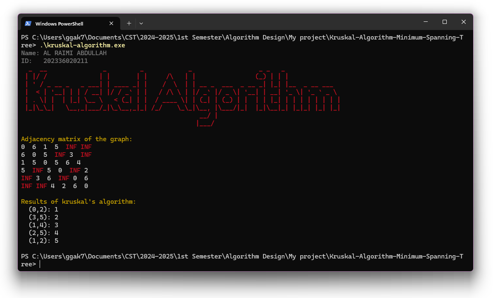

  

  
  
  

# Kruskal's Algorithm for Minimum Spanning Tree

Kruskal's Algorithm is a classic greedy algorithm used to find the Minimum Spanning Tree (MST) of a graph. The MST is a subgraph that connects all vertices together, without any cycles and with the minimal possible total edge weight. Kruskal’s Algorithm sorts all edges by their weight and adds them to the MST as long as they don't form a cycle. The algorithm is widely used in network design and other applications requiring minimum cost connectivity.

This project provides a full implementation of Kruskal's Algorithm in C++, including advanced data structures like Union-Find (Disjoint Set Union) to efficiently manage sets of vertices.

## Key Features

- **Graph Representation**: The graph is represented using an adjacency matrix, which simplifies the input and manipulation of edge weights.
- **Union-Find Data Structure**: Implements efficient Union-Find with path compression and union by rank to detect and prevent cycles during edge selection.
- **Edge Sorting**: All edges are sorted by their weight in ascending order, ensuring that the least expensive edges are considered first for inclusion in the MST.
- **Cycle Detection**: Detects and prevents cycles using the Union-Find structure, ensuring that the tree remains acyclic.
- **Minimum Spanning Tree Construction**: The algorithm builds the MST incrementally, starting from an empty graph and adding edges until it spans all vertices with minimal weight.
- **Graph Visualization**: Outputs the adjacency matrix and displays the edges in the MST.

## Algorithm Specification

### Kruskal's Algorithm Explanation:

Kruskal’s Algorithm works by treating the graph as a collection of independent edges and gradually connecting them in such a way that no cycles form and the total weight of the selected edges is minimized. The algorithm is greedy because it always chooses the smallest available edge at each step.

### Steps of Kruskal’s Algorithm:

1. **Initialization**: 
    - Start by creating a disjoint set for each vertex. Initially, each vertex is its own set.
    - Extract all edges from the adjacency matrix and store them in a list. Each edge is represented by its endpoints and weight.
    - Sort the list of edges in ascending order by weight.
    
2. **Edge Selection**:
    - Start with an empty MST.
    - Iterate through the sorted edge list. For each edge, use the Union-Find algorithm to determine whether the two vertices it connects are in the same set.
    - If the two vertices are in different sets (i.e., adding the edge won’t form a cycle), add the edge to the MST and union the two sets.
    - Stop when the MST contains exactly `n-1` edges, where `n` is the number of vertices in the graph.

3. **Termination**:
    - The algorithm terminates when the MST contains exactly `n-1` edges, where `n` is the number of vertices.
    - The result is the Minimum Spanning Tree, which connects all the vertices with the minimal total edge weight.

### Functions Used:

- **`makeSet(int n)`**: Creates a Union-Find set for each vertex, initializing each vertex as its own parent.
- **`findSet(int vertex)`**: Uses path compression to find the root (or representative) of the set containing the given vertex.
- **`Union(int set1, int set2)`**: Merges two sets using union by rank, ensuring that the smaller tree is attached to the root of the larger tree to keep the overall structure balanced.
- **`createMat()`**: Initializes the adjacency matrix of the graph, allowing the user to input edges and weights between vertices.
- **`dispMat()`**: Displays the current adjacency matrix, showing the weights between connected vertices.
- **`kruskal()`**: The core function that implements Kruskal's Algorithm, selecting edges and managing the MST construction.

## Algorithm Complexity

- **Time Complexity**: 
  - Sorting the edges takes \(O(E \log E)\), where \(E\) is the number of edges.
  - The Union-Find operations (find and union) are nearly constant time due to path compression and union by rank, resulting in an overall complexity of \(O(E \log V)\), where \(V\) is the number of vertices.
  
- **Space Complexity**: 
  - The space complexity is \(O(V + E)\), as we need to store the adjacency matrix, the list of edges, and the parent and rank arrays for Union-Find.

## Screenshot

Here’s a preview of the output:

## Learning Resources

- [Union-Find Algorithm](https://en.wikipedia.org/wiki/Disjoint-set_data_structure)
- [Kruskal's Algorithm](https://en.wikipedia.org/wiki/Kruskal%27s_algorithm)
- [Minimum Spanning Tree](https://www.geeksforgeeks.org/kruskals-minimum-spanning-tree-algorithm-greedy-algo-2/)

## Security Vulnerabilities

If you discover a security vulnerability, please email Abdullah Al Raimi at [abdullah@syalux.com](mailto:abdullah@syalux.com). All security vulnerabilities will be promptly addressed.

## License

This project is licensed under the [MIT license](../LICENSE).
