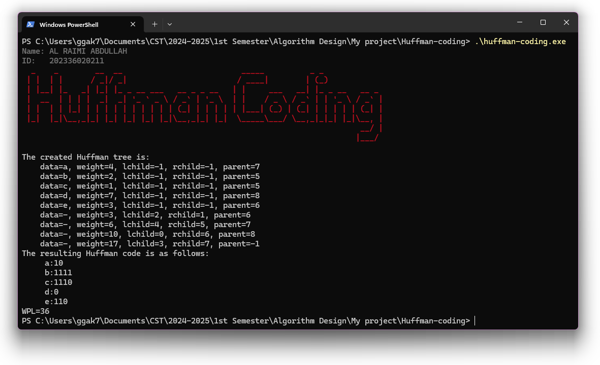

  

  
  
  

# Algorithm Design Projects

This repository contains several algorithm design projects I have completed as part of my coursework at Zhejiang Normal University, China, under the guidance of Professor 李小波. These projects cover fundamental algorithms and their applications, offering both theoretical insights and practical implementations in C/C++.

Each project is accompanied by a detailed explanation, including algorithm specifications, problem-solving approaches, source code, and experimental results. For more in-depth discussions, please follow the links provided to the individual project README files.

## Projects Overview

### 1. Infix Expression Evaluation
This project focuses on evaluating arithmetic expressions in infix notation using stacks to handle operator precedence and parentheses. It converts infix expressions to postfix form and then evaluates the result. The solution efficiently processes operators and operands, handling precedence rules for addition, subtraction, multiplication, and division.

- **Key Concepts**: Stack-based evaluation, operator precedence, infix to postfix conversion.
- **Sample Input**: `8-(3+2*6)/5+4`
- **Sample Output**: `9`

Preview of the project output:

[More Details](Infix-Expression-Evaluation)

### 2. Huffman Coding
Huffman coding is a widely used compression algorithm that minimizes the overall bit-length of the encoded data. This project implements the construction of a Huffman tree based on character frequencies, generating optimal variable-length binary codes.

- **Key Concepts**: Huffman tree, priority queues, binary encoding, weighted path length (WPL).
- **Sample Input**: Character set with frequencies.
- **Sample Output**: Huffman codes for each character.

Preview of the project output:

[More Details](Huffman-coding)

### 3. Kruskal's Algorithm for Minimum Spanning Tree
This project implements Kruskal’s algorithm to find the Minimum Spanning Tree (MST) of a weighted graph. The algorithm uses a union-find data structure to ensure efficient cycle detection during edge selection.

- **Key Concepts**: Union-find (disjoint set), edge sorting, MST.
- **Sample Input**: Weighted graph with 6 points.
- **Sample Output**: Edges included in the MST.

Preview of the project output:

[More Details](Kruskal-Algorithm-Minimum-Spanning-Tree)

### 4. Eight Queens Puzzle
The classic Eight Queens puzzle is solved using a backtracking algorithm to place eight queens on an 8x8 chessboard such that no two queens threaten each other. The project explores the use of recursion to find all valid solutions.

- **Key Concepts**: Backtracking, constraint satisfaction.
- **Sample Input**: Board size (e.g., 4).
- **Sample Output**: Valid queen placements.

Preview of the project output:

[More Details](Eight-queens-Puzzle)

### 5. 0/1 Knapsack Problem
This project tackles the 0/1 Knapsack problem using a brute-force approach. The algorithm explores all possible combinations of items to determine the one that maximizes the value while staying within a given weight limit.

- **Key Concepts**: Dynamic programming, brute-force search, combinatorial optimization.
- **Sample Input**: Items with weights and values, knapsack capacity.
- **Sample Output**: Maximum value and selected items.

[More Details](Knapsack-Problem-Dynamic-Programming)

### 6. Closest-Pair Problem
This project implements an efficient divide-and-conquer algorithm to find the closest pair of points from a set of points in a two-dimensional plane. It demonstrates the use of geometric algorithms and recursion to reduce the problem’s complexity.

- **Key Concepts**: Divide-and-conquer, geometric algorithms, distance calculation.
- **Sample Input**: Set of points in a 2D plane.
- **Sample Output**: Pair of closest points and their distance.

Preview of the project output:

[More Details](Closest-Pair-Problem)

## Learning Resources
For additional learning resources on algorithm design and implementation, feel free to explore the following references:

- **Books**: *"Introduction to Algorithms"* by Cormen et al.
- **Courses**: Online algorithm design courses on platforms like Coursera and edX.

## Security Vulnerabilities
If you discover a security vulnerability in any of the algorithms or code, please contact Abdullah Al Raimi at [abdullah@syalux.com](mailto:abdullah@syalux.com). I will address all security concerns promptly.

## License
This project is licensed under the [MIT license](LICENSE).
